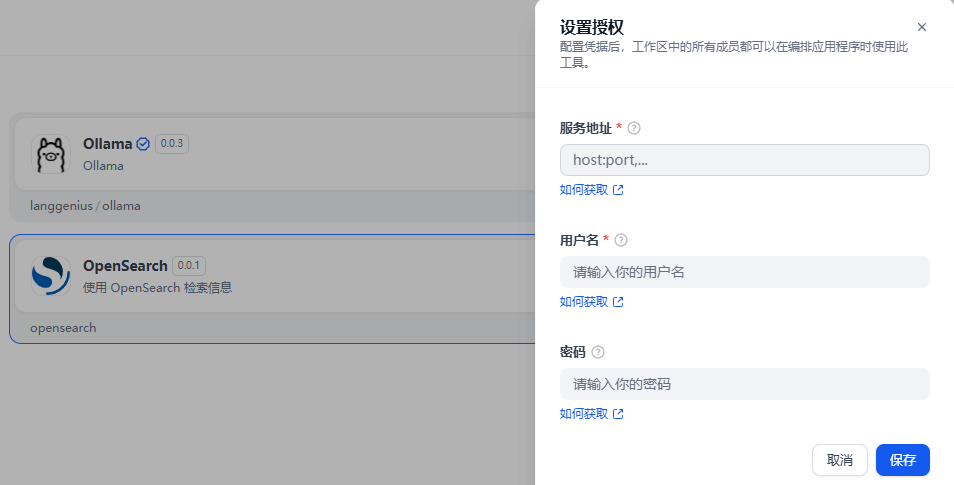
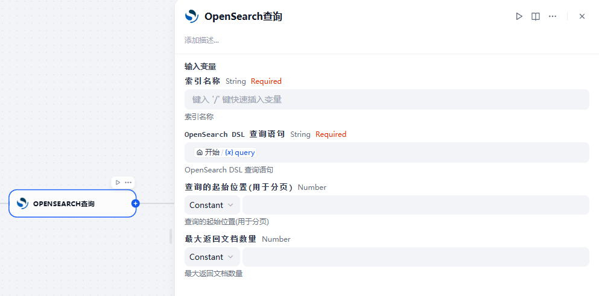

## OpenSearch plugin for Dify

**Author:** [mark](https://github.com/exitNA)  
**Version:** 0.0.2  
**Type:** tool  
**Github Repo:** [https://github.com/exitNA/opensearch](https://github.com/exitNA/opensearch)  
**Github Issues:** [issues](https://github.com/exitNA/opensearch/issues)  

---

### Description
This plugin is used to search data in OpenSearch.

## Usage
1. setup your credential
2. use tool in workflow

### credential

- endpoint: The endpoint of OpenSearch, such as localhost:9200
- user: The user of OpenSearch, such as xiaoming
- password: The password of OpenSearch user

### Query

- index: The index of OpenSearch
- query: The OpenSearch query dsl
- from: The start index of OpenSearch
- size: The size of OpenSearch

**output**
- total: number of total matched docs
- message: inner status message for debug
- result: the result document list

> More information about OpenSearch query dsl and paginate
> https://opensearch.org/docs/latest/query-dsl/
> https://opensearch.org/docs/latest/search-plugins/searching-data/paginate/#the-from-and-size-parameters
